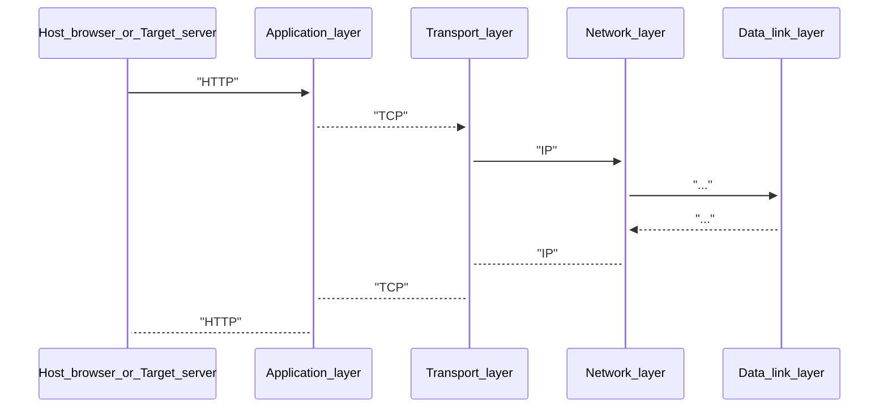

# HTTP 1.1, 2.0, 3.0

I've fucked up these questions during last interview. So it's better to fresh those knowledges up.

### HTTP 1.1
- Loads resources one by one. If one of requested files is broken - all files after it won't be downloaded. HTTP 2.0 has Multiplexing

### HTTP 2.0

Streams added

### HTTP 3.0

QUIC protocol added (UDP based). QUIC is an equivalent to TCP+TLS. 
Best for working with frequent reconnection (wifi -> 5G -> 4G -> Wifi -> another Wifi -> ...)

